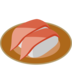

Sushiemoji
==========

高品質のすし絵文字を、使いやすいライセンスで提供します。

## What's this?

回転寿司の寿司ネタの絵文字です。

## License

Copyright 2017 yantene

Licensed under CC-BY 4.0: https://creativecommons.org/licenses/by/4.0/

## Usage

Unicode emoji の U+1F363 を好きなすし絵文字に置き換えたり、
Slack や Mastodon のカスタム絵文字として登録したりしてお使いください。

## Menu

 まぐろ ([16x16](16x16/maguro.png) [36x36](36x36/maguro.png) [72x72](72x72/maguro.png) [256x256](256x256/maguro.png) [SVG](svg/maguro.png))

 びんちょうまぐろ ([16x16](16x16/bincho_maguro.png) [36x36](36x36/bincho_maguro.png) [72x72](72x72/bincho_maguro.png) [256x256](256x256/bincho_maguro.png) [SVG](svg/bincho_maguro.png))

 ねぎとろ ([16x16](16x16/negitoro.png) [36x36](36x36/negitoro.png) [72x72](72x72/negitoro.png) [256x256](256x256/negitoro.png) [SVG](svg/negitoro.png))

 サーモン ([16x16](16x16/salmon.png) [36x36](36x36/salmon.png) [72x72](72x72/salmon.png) [256x256](256x256/salmon.png) [SVG](svg/salmon.png))

 いくら ([16x16](16x16/ikra.png) [36x36](36x36/ikra.png) [72x72](72x72/ikra.png) [256x256](256x256/ikra.png) [SVG](svg/ikra.png))

 いか ([16x16](16x16/ika.png) [36x36](36x36/ika.png) [72x72](72x72/ika.png) [256x256](256x256/ika.png) [SVG](svg/ika.png))

 たまご ([16x16](16x16/tamago.png) [36x36](36x36/tamago.png) [72x72](72x72/tamago.png) [256x256](256x256/tamago.png) [SVG](svg/tamago.png))
